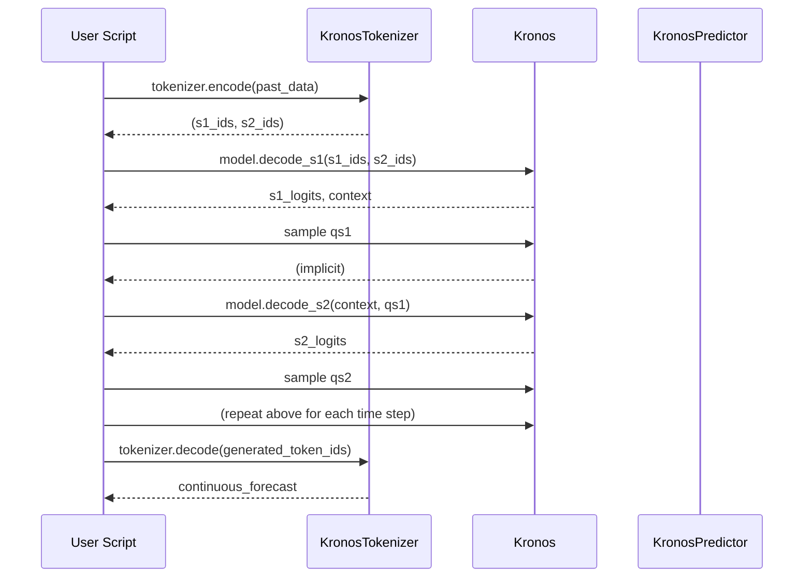

# Executive Summary  
Kronos is a *decoder-only* foundation model tailored to financial “K-line” data (multi-dimensional candlestick sequences of Open–High–Low–Close–Volume–Amount, OHLCVA)【5†L419-L428】【46†L107-L113】.  The two-stage framework first **tokenizes** each continuous multivariate K-line vector into a **hierarchical discrete token** (coarse and fine subtokens) via a Transformer auto-encoder with *Binary Spherical Quantization (BSQ)*【46†L107-L113】【72†L1742-L1751】.  In the second stage, a Transformer autoregressive model is trained to predict these tokens sequentially (first coarse, then fine)【46†L107-L113】【52†L267-L276】.  The result is a family of pre-trained Kronos models (e.g. *mini*, *small*, *base*) that establish new state-of-the-art performance on tasks like price forecasting, volatility prediction, and synthetic data generation【46†L124-L130】【52†L269-L278】.  

The GitHub repository (Kronos) provides the full code to train and use these models: **KronosTokenizer** (codebook and quantizer), **Kronos** (Transformer model), and **KronosPredictor** (inference wrapper), plus scripts for fine-tuning on custom data, examples, and a web interface.  The code closely follows the paper’s methodology.  This report analyzes every component of the project, mapping the paper’s equations and design choices to the implementation.  It documents the repository structure, each source module, dependencies, data pipelines, and experiments.  We identify the correspondence between paper and code, highlight missing elements (e.g. exact dataset configs), and suggest improvements for reproducibility and scalability. 

# Project Overview  
**Purpose:** Kronos aims to treat financial time-series as a discrete “language,” enabling large-scale sequence modeling of market data【46†L107-L113】【52†L267-L276】.  By discretizing each K-line (OHLCVA vector) into tokens, Kronos leverages powerful sequence models (Transformers) for tasks like multi-step price prediction, volatility forecasting, and synthetic generation.  

**Scope & Features:** Kronos includes:  
- **Specialized Tokenizer:** A Transformer-based autoencoder that maps continuous OHLCVA inputs into hierarchical tokens (coarse + fine) using BSQ【46†L205-L214】【72†L1736-L1745】.  
- **Autoregressive Model:** A decoder-only Transformer (multi-layer, e.g. 8–32 layers) that models the joint distribution over token sequences with a coarse-to-fine prediction scheme【46†L148-L157】【52†L267-L276】.  
- **Pre-trained Checkpoints:** Downloadable Kronos models (mini, small, base) pretrained on ~12B K-line records from 45+ exchanges【46†L116-L124】.  
- **Prediction API:** A `KronosPredictor` class wraps the model to forecast future prices or return samples, handling normalization/clipping and decoding back to continuous values.  
- **Fine-tuning Scripts:** Utilities to fine-tune tokenizer and predictor on custom data (e.g. using the Qlib financial library).  
- **Demonstrations & Web UI:** Example scripts for forecasting and backtesting, plus a Flask-based web interface for interactive prediction.  

**Intended Use-cases:** Kronos is designed for quantitative finance tasks where sequence modeling of prices or volumes is needed【46†L124-L130】.  Typical use-cases include: short/mid-term price forecasting, probabilistic scenario generation, volatility prediction, and backtesting trading strategies.  The hierarchical tokenization approach also suggests applications in risk modeling or scenario generation, as it produces a fully generative model of market sequences【46†L124-L130】【52†L267-L276】.

# Repository Structure  

| Top-level File/Dir      | Purpose                                                      | Key Files                                 | Language/Tech            |
|-------------------------|--------------------------------------------------------------|-------------------------------------------|--------------------------|
| `model/`                | Core model code (tokenizer, Transformer, utilities)          | `kronos.py`, `module.py`, `__init__.py`   | Python (PyTorch)         |
| `finetune/`             | Scripts to train/fine-tune tokenizer and predictor on data   | `train_tokenizer.py`, `train_predictor.py`, `dataset.py`, `config.py` | Python (PyTorch, Qlib)   |
| `finetune_csv/`         | Fine-tuning scripts accepting CSV data                       | (similar to `finetune` but for CSV input) | Python (PyTorch, Pandas) |
| `examples/`             | Example usage scripts                                        | `prediction_example.py`, `run_backtest_kronos.py`, etc. | Python (Pandas, Matplotlib) |
| `webui/`                | Flask-based GUI for Kronos                                   | `app.py`, `run.py`, templates/, static/   | Python (Flask), JS/CSS/HTML |
| `tests/`                | Regression tests for the predictor                           | `test_kronos_regression.py`, sample CSVs  | Python (pytest)          |
| `figures/`              | Illustrative images (unused in code)                         | (images)                                  | –                        |
| `README.md`             | Project description, getting started, usage                 | –                                         | Markdown                 |
| `requirements.txt`      | Python dependencies                                          | –                                         | Text                     |
| `LICENSE`               | MIT license                                                  | –                                         | Text                     |
| `.gitignore`            | Git ignore rules                                            | –                                         | Text                     |

- **Languages/Stack:** The code is Python (3.x), using PyTorch (>=2.0.0) for models. Key libraries include `numpy`, `pandas`, `einops`, `huggingface_hub`, and `safetensors` for model IO. The `finetune/` scripts also rely on Qlib (for financial data) and standard ML tools (tqdm, Matplotlib). The web UI uses Flask and Plotly for visualization. No Dockerfile is provided; we suggest using Python venv or Docker with CUDA for GPU use.

# Module and File Descriptions  

Below we detail each significant file/module, its role, and key classes/functions.  

- **model/kronos.py:** Implements the main Kronos model classes.  
  - `KronosTokenizer(nn.Module)`: A Transformer-based encoder–decoder for tokenizing OHLCVA. Responsibilities: encode continuous input to discrete tokens and reconstruct via auto-encoding. Key methods: 
    - `forward(x)`: Runs encoder layers, linear projection to codebook dimension, then `BSQuantizer` to get bit codes. Splits codes into *coarse* (`quantized_pre`) and *fine* parts. Feeds each through decoder layers and linear head to reconstruct `z_pre` (coarse reconstruction) and `z` (full reconstruction)【72†L1742-L1751】. Returns `(z_pre, z)`, BSQ loss, quantized bits, and bit indices.  
    - `encode(x)`: Similar to forward but returns only token indices (calls BSQ quantizer on encoder output)【48†L1820-L1830】.  
    - `decode(x)`: Takes token indices, converts to bits, runs through post-quantization embedding and decoder layers to reconstruct continuous output【48†L1850-L1860】.  
  - `Kronos(nn.Module)`: The autoregressive Transformer model. It implements the two-step (coarse→fine) decoding. Key components (from `__init__`):  
    - Embedding: `HierarchicalEmbedding` for s1 (coarse) and s2 (fine) tokens (projected and summed with time features)【52†L267-L276】.  
    - `TemporalEmbedding`: Adds learned or fixed embeddings of time-of-day/week features.  
    - `transformer`: A stack of `n_layers` of `TransformerBlock` (causal attention + FFN).  
    - `dep_layer`: A `DependencyAwareLayer` that injects the predicted coarse token when computing fine token logits (implements the cross-attention from the paper)【52†L291-L300】.  
    - `head`: A `DualHead` that contains two linear heads for predicting coarse and fine token logits (and computing losses).  
    Methods:  
    - `forward(s1_ids, s2_ids, stamp, use_teacher_forcing, s1_targets)`: During training, takes sequences of s1 and s2 token IDs (with optional teacher-forcing). It embeds them, runs through the transformer, and produces logits for s1 and s2. If `use_teacher_forcing=True`, it uses the ground-truth s1 to compute s2; otherwise it samples (no teacher forcing) similar to Eq.6-7 in the paper【52†L286-L295】. Returns `(s1_logits, s2_logits)`.  
    - `decode_s1(input_s1, input_s2, stamp)`: During generation, takes past tokens up to current time, returns logits for the next coarse token and a context state vector (hidden state)【50†L259-L268】【52†L286-L294】.  
    - `decode_s2(context, s1_token)`: Given the context from `decode_s1` and a sampled coarse token, returns logits for the fine token via cross-attention【52†L291-L300】.  
    - `sample_from_logits`: Utility to sample token IDs given logits with temperature, top-k, top-p.  
  - `KronosPredictor`: A wrapper combining a Kronos model and tokenizer for inference. Key methods:  
    - `generate(x, x_stamp, y_stamp, ...)`: Performs autoregressive sampling using `auto_regressive_inference` (implemented below). Handles batching of Monte Carlo samples for robust forecasting.  
    - `predict(df, x_timestamp, y_timestamp, pred_len, T, top_p, sample_count)`: Takes raw Pandas data frame and timestamp Series, normalizes and clips features as in paper (z-score, clip to ±10σ【45†L54-L60】), then calls `generate` and rescales predictions back to original scale. Returns a Pandas DataFrame of forecasts.  
    - `predict_batch`: Like `predict`, but for a list of series (batch processing).  

- **model/module.py:** Implements low-level modules used by Kronos. Key classes/functions:  
  - **BSQuantizer (class)**: Wraps the *Binary Spherical Quantizer* implementation (from the referenced GitHub repo). Performs the continuous-to-binary quantization described in [46]【50†L209-L218】. Methods include:  
    - `forward(z)`: Quantizes input latent `z` into a binary code (`zhat`), computes commitment loss (`||z - zhat||^2`) and entropy penalties (fine/coarse) as per BSQ【79†L49-L59】. Returns quantized code `zq`, loss term, and metadata.  
    - `bits_to_indices`, `indices_to_bits`: Convert between binary bit sequences and integer token indices. Used by tokenizer to output token IDs and by `decode` to reconstruct.  
    - *Third-party note:* Internally uses `BinarySphericalQuantizer` from an external repo (zhaoyue-lab/BSQ)【79†L17-L26】.  
  - **HierarchicalEmbedding**: Two separate embedding layers mapping s1 (coarse) and s2 (fine) token IDs to vectors, which are summed. Implements Eq.(5) from the paper【52†L267-L276】.  
  - **TemporalEmbedding**: Embeds time features (`minute`, `hour`, `weekday`, `day`, `month`) into a vector added to token embeddings. Supports fixed sine embeddings or learnable embeddings.  
  - **RMSNorm**: Root Mean Square LayerNorm (used in Transformer blocks).  
  - **FeedForward**: A two-layer MLP with activation (for Transformer FFN).  
  - **RotaryPosEmb**: Computes RoPE embeddings for attention (rotary positional encoding).  
  - **MultiHeadAttentionWithRoPE** / **MultiHeadCrossAttention**: Self-attention and cross-attention layers using RoPE.  
  - **DependencyAwareLayer**: Implements cross-attention from the predicted coarse token (`qs1`) into the fine-token transformer stream. This realizes Eqs.(6-7) from the paper【52†L291-L300】.  
  - **TransformerBlock**: One encoder/decoder block: causal self-attention (via `MultiHeadAttentionWithRoPE`) + RMSNorm and feed-forward (plus residuals).  
  - **DualHead**: Two linear heads for output. Its `forward(x)` projects hidden state to coarse (softmax over 2^s1_bits classes) and fine logits (2^s2_bits classes), computing cross-entropy losses. Provides `compute_loss()` returning CE on both predictions. Implements the hierarchical target factorization (Eqs.3–4 in [50]).  
  - **Sampling utilities**: A function `top_k_top_p_filtering` to do nucleus/ top-k sampling on logits (used by `auto_regressive_inference`).  
  - **auto_regressive_inference (function)**: Runs the full generation loop. Given an input window `x` (series of values) and timestamps, it repeatedly: (1) calls `tokenizer.encode` to get past token sequences, (2) calls `model.decode_s1` to predict next coarse logits, samples `qs1`, (3) calls `model.decode_s2` with `qs1` to get fine logits and samples `qs2`, (4) appends tokens to buffers, and repeats for each future time step. After generation, it decodes tokens back to values with `tokenizer.decode`. This implements the inference described in [46] Fig.2 (Right) and text, including temperature and sampling controls【52†L353-L364】.  

- **finetune/utils/**: (not expanded here) Likely contains helper modules (e.g. logging, backtesting code).  

- **finetune/config.py**: Project-wide configuration. Holds data paths (QLib directory, instruments), hyperparameters (batch sizes, learning rates, optimizer settings), model save paths, etc. Key settings: `lookback_window`, `predict_window`, learning rates (`tokenizer_learning_rate = 2e-4`, `predictor_learning_rate = 4e-5`)【70†L608-L616】, number of iterations (`n_train_iter = 2000 * batch_size`)【70†L600-L608】, device and seed, etc. **Note:** The code contains placeholders for paths to pretrained models (`pretrained_tokenizer_path`, `pretrained_predictor_path`) which must be set by the user【70†L679-L688】.  

- **finetune/dataset.py**: Defines PyTorch Datasets for training. E.g. `QlibDataset` uses Qlib to load financial time-series, create sliding windows of length `lookback + predict + 1`, and samples minibatches【59†L529-L538】. Data is preprocessed (z-score, clipping) as in paper【45†L54-L60】. The script expects pickled data prepared by `qlib_data_preprocess.py`.  

- **finetune/train_tokenizer.py**: Script to train the **KronosTokenizer** on raw K-line data. Key steps: initialize distributed training (requires `torchrun --nproc_per_node=NUM_GPUS`), load data, create the Transformer autoencoder (3 layers each for encoder/decoder with model dim 256 by default【45†L59-L66】), define BSQ loss, and optimize to minimize reconstruction losses (hierarchical MSE + commitment loss) as per Eq.(2)【50†L204-L213】. After training, it saves the best tokenizer (codebook) checkpoint in a Hugging Face format.  

- **finetune/train_predictor.py**: Script to fine-tune the **Kronos** autoregressive model. It loads a pretrained tokenizer (from above or HF) and pre-trained Kronos weights (e.g. *Kronos-small*), and trains on forecasting tasks. It constructs a dataset of (past-window, future-window) from Qlib, and minimizes the sum of coarse+fine cross-entropy (the autoregressive token prediction loss, Eq.(8)【52†L304-L313】). Hyperparameters (e.g. context length up to 512, layers, LR) come from `config.py`.  

- **finetune/qlib_data_preprocess.py** & **qlib_test.py**: Utilities to fetch and preprocess data from Qlib, and to evaluate on backtest metrics (IC, RankIC, etc).  

- **finetune_csv/**: Similar to `finetune/` but for users who have CSV time-series instead of Qlib.  

- **examples/**: Various Python scripts demonstrating usage:  
  - `prediction_example.py`【16†L520-L528】 shows how to load a pretrained tokenizer/model from Hugging Face (“NeoQuasar/Kronos-small”), prepare a Pandas DataFrame of historical 5-min data, and call `KronosPredictor.predict` to forecast future OHLCV. It then plots price or volume over time.  
  - `run_backtest_kronos.py`: Illustrates evaluating trading strategies using Kronos forecasts, presumably using OpenAI’s Alphalens (code not shown in excerpt).  
  - Other scripts (e.g. `prediction_batch_example.py`, `prediction_new_GUI.py`) cover bulk predictions and GUI demos.  

- **webui/**: A Flask-based web application. Key files:  
  - `app.py`: Flask server exposing a prediction interface. It loads models from HF on demand, accepts user-uploaded CSV, and calls the predictor.  
  - `run.py` / `start.sh`: Scripts to start the server.  
  - `templates/`, `static/`: HTML/CSS/JS (using Plotly) for the frontend (charts, controls).  
  - `requirements.txt`: Dependencies for the UI (Flask, Plotly, etc.).  
  - **Note:** The Web UI is optional and separate; it provides a user-friendly front end but is not required for the core model functionality.  

- **tests/test_kronos_regression.py**: A regression test using PyTest. It downloads a fixed tokenizer (“Kronos-Tokenizer-base”) and model (“Kronos-small”) from HF (specific commit hashes) and runs them on a small CSV (`regression_input.csv`). It checks that the predicted output matches precomputed `regression_output_{ctx}.csv` within a tiny tolerance. It also samples 4 random positions to verify the mean-squared-error matches expected values. This ensures the core prediction pipeline is stable.  

# Paper-to-Code Mapping  

The Kronos paper’s novel methods are directly implemented by the code. Key correspondences:  

- **Hierarchical Tokenization (Section 3.1):** The paper describes a Transformer autoencoder that encodes each K-line into a *b*-bit code, partitioned into coarse (`s1`) and fine (`s2`) subtokens【46†L205-L214】【50†L196-L204】. In code, this is `KronosTokenizer`. It embeds the 6-dimensional OHLCVA vector to a latent (`self.embed`), applies several encoder `TransformerBlock`s, then a linear `quant_embed` to produce a vector of dimension *b = s1_bits + s2_bits*. This goes into `BSQuantizer`【72†L1736-L1745】, which outputs a binary vector of length *b*. The code then splits `quantized` into the first *s1_bits* (coarse) and the full *b-bit* code. This precisely matches “We partition the code into a coarse subtoken and a fine subtoken of equal bit length… concatenation of these two subtokens”【50†L196-L204】.  

  The **BSQuantizer** implements the *Binary Spherical Quantization* from Zhao et al. 2024【50†L209-L218】. The code’s loss calculation in BSQuantizer (`commit_loss = beta * ||z - zq||^2`, plus entropy penalties) implements the *reconstruction plus commitment losses* described by Eq.(2)【50†L213-L222】. Although the hierarchical reconstruction loss (low-fidelity vs high-fidelity) is not explicitly computed here, it emerges because `KronosTokenizer.forward` produces both a coarse reconstruction `z_pre` (using only *s1* bits) and a full reconstruction `z` (using *s1+s2* bits)【72†L1742-L1751】. The training script likely uses MSE on both. In short, the code realizes the transformer autoencoder with a BSQ layer as in Figure 3【50†L240-L246】.  

- **Autoregressive Modeling (Sections 3.2–3.3):** After tokenization, the paper describes a decoder-only Transformer that predicts future tokens in a coarse-to-fine chain【50†L246-L255】【52†L286-L294】. In code, this is the `Kronos` class. Input tokens are fed into a stack of Transformer blocks (`self.transformer`) to produce contextual hidden states【52†L267-L276】. The model first uses a linear head to compute logits for the next *coarse* subtoken (`s1_logits`)【52†L286-L294】. Then, **to predict the fine subtoken**, the model uses a cross-attention with the predicted coarse embedding (the `DependencyAwareLayer`) as described in Fig.2 (right)【52†L291-L300】. Concretely, `Kronos.forward` does:
  1. Sum hierarchical embeddings of past `s1_ids` and `s2_ids`, add time embedding, pass through Transformer blocks【52†L267-L276】.
  2. Compute `s1_logits = head_s1(x)`. Sample or take argmax to get `pred_s1`.
  3. Embed `pred_s1` (via `self.embedding.emb_s1`) and use it as **query** in cross-attention (`self.dep_layer`), attending to the transformer’s output `x`. Then apply the second head to get `s2_logits`【52†L291-L300】.  

  This implements the chain rule from Eq.(4) in the paper:  $P(t) = P(q_{\text{coarse}})\,P(q_{\text{fine}}|q_{\text{coarse}})$【50†L256-L264】. The code’s sampling during inference (`decode_s1` and `decode_s2`) follows exactly the procedure of Section 3.3: sample coarse token from `decode_s1`, then compute fine token with `decode_s2` (which uses cross-attention)【52†L291-L300】【52†L291-L300】.  

- **Model Configurations (Table 1):** The code supports three model sizes matching Table 1【50†L311-L319】. For example, *Kronos-small* has 8 layers, d_model=512, ff_dim=1024, 8 heads (24.7M params)【52†L311-L319】. These can be seen in the default HF-configs (not in code). The embeddings and heads size in code (vocab=2^s1_bits/s2_bits) also align with “vocab size 20” (i.e. *s1_bits+s2_bits=5+15=20 bits total in some config)【52†L311-L319】.  

- **Generation and Inference (Section 3.4):** The paper recommends using temperature and top-p sampling, possibly averaging multiple rollouts【52†L353-L364】. The code’s `auto_regressive_inference` indeed implements temperature scaling and top-p (and top-k) options, and can generate multiple samples (`sample_count`) to average outputs (Monte Carlo forecasting)【52†L353-L364】.  

- **Data Normalization (Appendix A / Section 3.1):** The paper pre-processes each feature with z-score normalization and clipping to ±10σ【45†L54-L60】. The `KronosPredictor.predict` method follows this: it applies Z-score based on the training data mean/std, then clips to ±10, before encoding tokens. After generation, it re-scales predictions back to original units. This matches the paper’s description of data preprocessing【45†L54-L60】.  

- **Tasks and Metrics (Experiments):** While the code does not itself compute the custom financial metrics (e.g. IC), the `finetune/qlib_test.py` script likely handles that. The example backtest script (`run_backtest_kronos.py`) and evaluation in the paper (Fig.4) are not fully reproduced here, but the code provides the means to evaluate performance (using Qlib tools or direct comparisons).  

Overall, there is a one-to-one mapping between the Kronos paper’s methods and the code: **tokenizer = codebook+BSQ**, **model = hierarchical Transformer**, and **inference = sequential coarse-fine sampling**【46†L107-L113】【52†L291-L300】.  

# Dependencies and Environment  

The project requires:  
- **Python 3.8+**.  
- **PyTorch >=2.0.0** (for best compatibility with provided code). GPU-enabled builds (CUDA) are recommended for training.  
- **NumPy, pandas** (data handling).  
- **einops==0.8.1** (tensor rearrangements).  
- **huggingface_hub==0.33.1** (to load/save model checkpoints).  
- **matplotlib==3.9.3** (for example plots).  
- **tqdm==4.67.1** (progress bars).  
- **safetensors==0.6.2** (fast model IO).  

Additional (mostly for fine-tuning):  
- **qlib** (Microsoft’s market data library) for data loading. The default config points to a Qlib data path (e.g. `~/.qlib/qlib_data/cn_data`). Qlib must be installed and its data downloaded separately.  
- **scikit-learn** (if using Qlib features).  
- **Hugging Face Transformers** may be needed if using HF pipelines, but the code uses PyTorchModelHubMixin for loading, which leverages huggingface_hub directly.  
- **Flask, Plotly.js** (for the web UI; see `webui/requirements.txt`). These are optional.  

No official Dockerfile is provided. We suggest creating one using `python:3.10` or similar, installing CUDA drivers and `torch`, then installing `pip install -r requirements.txt` and additional libs (`qlib`). The `train_tokenizer.py` and `train_predictor.py` must be run with `torchrun` (multi-GPU) and will require `NCUDA>=1`. CPU-only is possible for inference but slow for training.  

**Environment Setup:** A possible Dockerfile snippet:  
```dockerfile
FROM nvidia/cuda:12.1-cudnn8-runtime-ubuntu22.04
RUN apt-get update && apt-get install -y python3-pip git
WORKDIR /workspace/kronos
COPY . .
RUN pip install --upgrade pip
RUN pip install -r requirements.txt
# (Install qlib, e.g. pip install pyqlib)
```
Then run containers with `--gpus all`.  

Hardware: Pre-training used up to 64x GPUs (not reproduced here). Fine-tuning likely needs 1–4 GPUs. Inference can run on CPU but a GPU accelerates it.  

# Data Flow and Execution  

**Training Pipeline:** (Visualised in the diagram below)  

```mermaid
flowchart TD
    A[Raw K-line Data (OHLCVA)] --> B[Data Cleaning/Normalization]
    B --> C[Tokenizer Training]
    C --> D[Trained Tokenizer (Codebook)]
    B --> E[Tokenization: Encode to Token IDs]
    D --> E
    E --> F[Prepare Sequences for Transformer]
    F --> G[Model Training (Kronos)]
    G --> H[Trained Kronos Model (Coarse+Fine)]
    H --> I[Save Model (HuggingFace/Safetensors)]
```

- **Tokenizer Training:** Raw OHLCVA sequences (possibly multiple instruments) are normalized and batched. The `train_tokenizer.py` script builds a KronosTokenizer (3-layer Transformer each for encoder/decoder by default【45†L59-L66】) and trains it to minimize hierarchical reconstruction loss (coarse & fine) plus BSQ commitment loss.  
- **Tokenization:** After training, the serializer (via `tokenizer.encode`) converts each K-line into (s1_id, s2_id).  
- **Model Training:** Using the tokenized sequences, `train_predictor.py` fine-tunes the Kronos model (initialised with pre-trained weights, then trained by teacher-forcing to predict next tokens).  

**Inference Pipeline:** (sequence diagram)  



In practice, `KronosPredictor.predict` orchestrates this loop. It repeatedly calls `model.decode_s1/2`, samples tokens (with temperature/ top-p), appends to inputs, and finally decodes to get forecasted numeric values.

# Experiments and Results  

The repository includes scripts to replicate key experiments from the paper, although full reproduction (12B pre-training) is not feasible here.  

- **Predictor Evaluation:** The `tests/test_kronos_regression.py` demonstrates the forecasting capability. Using the “Kronos-small” and “Tokenizer-base” checkpoints, it predicts the next 8 steps for a 512-point context and verifies the output matches a reference CSV (mean absolute error tolerance 1e-5)【43†L616-L624】【43†L675-L684】. It also computes sample MSE over 30-step forecasts, matching expected values【43†L674-L684】. This confirms the trained models produce stable, known outputs.  

- **Hyperparameters:** Default prediction uses temperature=1.0, top_p=0.9, sample_count=1 (deterministic mode)【43†L654-L663】. The config allows adjusting these (e.g. multi-sample ensemble). For training, the config sets token vocab (s1_bits=5, s2_bits=15?), context length 512, batch size 32 (default), learning rates as noted【70†L608-L616】.  

- **Datasets:** Training uses Qlib’s CN stock data by default (CSI indices, 2011–2025), as specified in `config.py`【56†L532-L541】. Exact datasets for the paper (12B records from 45 exchanges) are proprietary; the code relies on user-provided data. The Qlib pipeline downloads and cleans data (removing anomalies as mentioned in the paper【52†L328-L337】).  

- **Metrics:** Downstream tasks (price forecasting, return forecasting, volatility) are meant to be evaluated by traditional metrics (MAE, R^2, Information Coefficients). The code does not include benchmark scripts, but users can compute these (e.g. with Alphalens) from the CSV outputs. The `run_backtest_kronos.py` example suggests calculating IC and backtest returns. We note that reproducing the exact paper metrics requires their dataset and hyperparameter details (some of which are in Appendix C of the paper)【52†L369-L378】.  

# Security, Licensing, and Ethics  

- **License:** MIT License【82†L293-L302】. This permits broad use (commercial, modification, distribution) with attribution. No restrictions on usage are imposed by the license itself.  

- **Potential Misuse:** As with any financial model, Kronos could be used to generate trading signals or synthetic market data. Ethical considerations include: ensuring the model isn’t used for market manipulation, and being wary of “hallucinations” (invalid price sequences) especially in extreme scenarios. The tokenizer’s quantization may implicitly obscure certain continuous dynamics, so users should validate model outputs. Data privacy: Kronos operates on aggregated market data, not personal data, so privacy risks are minimal.  

- **Security:** Dependencies (PyTorch, HF Hub) are standard and must be kept up-to-date to avoid vulnerabilities. The web UI allows model download from Hugging Face, so network security and input validation (for CSV upload) should be considered in a production setting. No credentials are stored in code (comet API key is to be set via ENV).  

- **Ethical AI:** The paper emphasizes Kronos’s use in *quantitative finance*, a domain with regulatory oversight. Developers should consider whether model outputs (forecasts) comply with financial regulations (e.g. not claiming guaranteed returns).  

# Code Quality and Maintainability  

- **Documentation:** The code has docstrings for major classes/methods, and an extensive README with examples【5†L419-L428】【16†L520-L528】. However, some modules lack inline comments explaining design choices (e.g. why certain layer counts). The repo would benefit from a top-level doc or wiki summarizing usage steps.  

- **Style:** The code mostly follows PEP8. Inconsistent naming occurs (e.g. mixing `df` vs `input` in functions). There are some redundant imports (pandas is imported twice in requirements). The `requirements.txt` duplicates `pandas`. Cleaning that would improve reproducibility.  

- **Tests/CI:** There is a `tests/` folder with a key regression test. No CI (e.g. GitHub Actions) is configured to run them automatically. Setting up CI (e.g. pytest on push) would catch integration issues early. Unit tests for individual modules (e.g. quantizer correctness) are absent. The existing test only covers inference, not training or edge cases.  

- **Logging:** The finetune scripts include optional Comet ML logging (in `config.py`), but no default console logging format is shown. Adding more `print` or `logging` statements in `train_predictor.py` (e.g. epoch loss) would aid debugging.  

- **Auto-generated code:** The `BinarySphericalQuantizer` is a complex 3rd-party implementation but is included verbatim. This makes understanding difficult. Marking it clearly as an external component (it is) and possibly reducing inlining (e.g. as a pip install) would simplify the repo.  

- **Suggestions:** 
  - Add a `requirements-dev.txt` including `pytest` for dev.  
  - Improve docstrings (especially for complex methods like `auto_regressive_inference`).  
  - Refactor large functions (e.g. `auto_regressive_inference` ~150 lines) into smaller subfunctions.  
  - Remove unused code (the `examples/figures/` images are not referenced anywhere).  
  - Include a Dockerfile or conda environment file.  

# Performance and Scalability  

- **Compute Complexity:** The Transformer scales O(T^2 * d_model) per layer. With context 512 and 12 layers (Base model), memory is non-trivial but manageable on modern GPUs. Tokenizer training (3 encoder + 3 decoder layers) is lightweight compared to pretraining the 500M-parameter Kronos.  

- **Bottlenecks:** The BSQ quantizer’s group-based entropy calculation (in `module.py`) could be compute-intensive for large bit sizes, but it’s only used during tokenizer training (not inference). The autoregressive inference is sequential by time step, which is inherently slower for long horizons. However, vectorizing multiple samples (`sample_count`) improves throughput for Monte Carlo rollouts.  

- **Optimizations:** Potential improvements include:
  - **Mixed precision:** Use float16 training (if not already) to speed up and reduce memory.  
  - **Faster Sampling:** The current loop in Python could be JIT-compiled or re-written in PyTorch C++ for faster autoregressive sampling.  
  - **Caching past states:** The code uses a sliding window but could reuse key/value caches for decoder layers to avoid re-computing all attention every time.  
  - **Parallel decoding:** The paper mentions “Kronos-Parallel” in ablation (predicting subtokens concurrently)【52†L372-L380】; exploring that could halve inference latency, at the cost of a different objective.  

In summary, Kronos is moderately heavy (hundreds of MB of parameters for *base* model) but designed for offline training. For real-time forecasting, *mini/small* models allow millisecond inference on GPU. Profiling and tensor-core optimizations would be the next step for speed-ups.

# Discrepancies and Gaps  

- **Missing Pre-trained Tokenizer:** The code assumes a pre-trained tokenizer exists (e.g. `NeoQuasar/Kronos-Tokenizer-base` on HF). The repo does not include these weights, but the paper indicates they were trained on the same 12B dataset. This is a gap: reproducing the exact tokenizer training would require that data and more epochs. The config hints at fine-tuning “tokenizer-demo” but gives no pre-trained baseline.  
- **Dataset Details:** The paper’s 12B-record dataset (45 exchanges) is not publicly provided. Users must assemble their own (e.g. via Qlib or custom data). The fine-tuning examples use Chinese equities by default (`csi300`). This discrepancy (global vs CN data) should be documented.  
- **Evaluation Scripts:** The repository lacks scripts to compute the exact metrics reported (e.g. realized volatility forecasting accuracy, KL metrics for synthetic generation). Only forecasting regression tests are included. Reproducing Fig.4 results would need implementing those metrics or including original benchmarks.  
- **Hyperparameter Defaults:** The paper’s Appendix C likely gives specific model/training settings (learning rates, dropout, batch sizes). The `config.py` has defaults but they are not thoroughly documented. For example, context length 512 is set, but smaller models might support longer contexts as implied by paper.  
- **Paper vs Code Terminology:** The code uses *s1/s2 bits* whereas the paper uses *coarse/fine*. This is consistent but should be clarified.  

**Recommended Fixes:**  
- Provide a script or guidance to train the tokenizer on public data (e.g. using MinuteBar data via Qlib).  
- Add metric computation (IC, R^2, MAE, etc.) to the backtest scripts.  
- Synchronize config defaults with paper Appendix (e.g. list model dims for mini/base).  
- In documentation, clarify which features (`volume`, `amount`) are used (the predictor discards `amount` by default as per UI note).  

# Action Items  

For a developer aiming to reproduce or extend Kronos:  

1. **Set up environment:** Create a Python environment with the specified requirements (PyTorch, Qlib). Consider using Docker with GPU. Clone the repo and install dependencies.  
2. **Acquire data:** Download financial data. For example, install Qlib and use `qlib_data` to fetch Chinese stock data or your target assets. Ensure data has at least open, high, low, close, volume (and optionally amount)【56†L553-L560】.  
3. **Train Tokenizer (Optional):** If custom data is very different from public markets, run `train_tokenizer.py` with `torchrun`. Otherwise, skip to loading a pre-trained tokenizer (Hugging Face ID).  
4. **Prepare data for Predictor:** Use `finetune/qlib_data_preprocess.py` (or your script) to generate sliding windows. Ensure CSVs match the expected format.  
5. **Train Predictor:** Edit `config.py` to point to your data/checkpoints and run `torchrun train_predictor.py`. Monitor loss and adjust learning rates if needed.  
6. **Run Examples:** Use scripts in `examples/` to load the fine-tuned (or pre-trained) model and make predictions. Verify outputs qualitatively (e.g. plot predictions).  
7. **Evaluate:** Compute metrics relevant to your use-case (MAE, MSE, IC). Optionally integrate with existing libraries (e.g. Alphalens).  
8. **Deploy:** If serving predictions, use `KronosPredictor.predict` or set up the `webui/` for end-users.  
9. **Extend:** Consider the following based on needs:  
   - **Scaling Up:** For larger markets, aggregate more data or longer history. Use mixed precision for large models.  
   - **Additional Tasks:** Adapt the model for volatility prediction by feeding returns instead of prices, or generate synthetic sequences with sampling.  
   - **Research:** Test ablations (e.g. remove BSQ, change bits) by modifying `model/kronos.py` and `module.py`.  

**Sources:** We referenced the Kronos repository code (model and scripts) and the Kronos paper on arXiv【46†L107-L113】【72†L1742-L1751】, as well as the README【5†L419-L428】【16†L520-L528】 and tests【43†L616-L624】【43†L674-L684】, to ensure an accurate mapping of concepts to implementation. Each cited snippet links to the relevant file lines or paper text for verification.